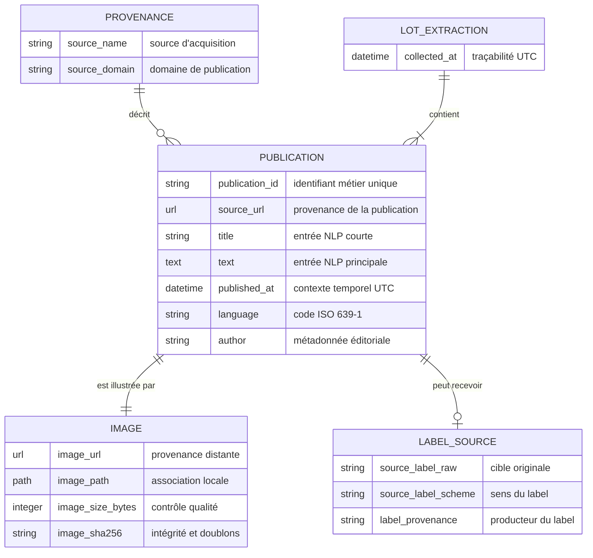

# Schéma conceptuel des publications multimodales

## Objectif

Ce modèle décrit la **signification métier** des données transformées, indépendamment de Snowflake ou d’un autre système de stockage. Il garantit qu’une publication associe son texte à une image locale validée et conserve la provenance des éventuels labels.

Le fichier Mermaid directement réutilisable est disponible dans [`E03_SCHEMA_CONCEPTUEL_DONNEES.mmd`](E03_SCHEMA_CONCEPTUEL_DONNEES.mmd).

## Modèle conceptuel Mermaid

## Lecture des relations

- Une **publication** possède exactement une **provenance** et appartient à exactement un **lot d’extraction**.
- Une **publication** est obligatoirement associée à une seule **image**. Sans image locale valide, elle est rejetée.
- Une **publication** peut ne posséder aucun **label source**. C’est le cas de NewsData.io.
- Lorsqu’un label existe, sa valeur, son système de classification et son producteur sont conservés ensemble.

Le fichier Parquet est volontairement aplati en une table de 17 colonnes. Ce choix de stockage ne modifie pas le modèle conceptuel ci-dessus.

## Dictionnaire des champs finalisés

| Champ | Type final | Obligatoire | Rôle métier et usage IA |
|---|---|---:|---|
| `publication_id` | chaîne | Oui | Identifiant stable, dédoublonnage et liaison de la publication à son image. |
| `source_name` | chaîne | Oui | Source d’acquisition : NewsData.io, PolitiFact ou Fakeddit. Utile pour analyser les biais par source. |
| `source_domain` | chaîne | Oui | Domaine éditorial ou domaine cible, sans `www.`. Métadonnée de provenance. |
| `source_url` | URL HTTP(S) | Oui | URL de l’article ou du post. Traçabilité et contrôle manuel. |
| `title` | chaîne | Conditionnel | Texte court utilisable par un traitement NLP. `title` ou `text` doit être renseigné. |
| `text` | texte long | Conditionnel | Entrée NLP principale : contenu, résumé, affirmation ou titre nettoyé. `title` ou `text` doit être renseigné. |
| `image_url` | URL HTTP(S) | Oui | URL distante d’origine de l’image associée. |
| `image_path` | chemin | Oui | Chemin local de l’image validée. Garantit que le texte et l’image restent exploitables ensemble. |
| `image_size_bytes` | entier | Oui | Taille réelle du fichier. Contrôle des images vides ou modifiées. |
| `image_sha256` | chaîne hexadécimale | Oui | Empreinte du contenu de l’image, utilisée pour l’intégrité et la détection de doublons. |
| `published_at` | date-heure UTC | Oui | Date de publication normalisée. Analyse temporelle et séparation chronologique de datasets. |
| `language` | chaîne ISO 639-1 | Oui | Langue sous forme `fr` ou `en`. Routage vers le bon traitement NLP. |
| `author` | chaîne | Non | Auteur ou liste d’auteurs réunie dans une chaîne. Métadonnée éditoriale. |
| `source_label_raw` | chaîne | Non | Label original sans conversion silencieuse. Peut servir de cible après interprétation documentée. |
| `source_label_scheme` | chaîne | Non | Décrit le système qui donne son sens au label brut. |
| `label_provenance` | chaîne | Non | Organisation ou méthode ayant produit le label. Indique son niveau de confiance. |
| `collected_at` | date-heure UTC | Oui | Date de collecte du lot, distincte de la date de publication. Traçabilité ETL. |

## Mapping par source

| Champ métier | NewsData.io | PolitiFact | Fakeddit |
|---|---|---|---|
| Identifiant | préfixe `newsdata_` + `article_id` | préfixe `politifact_` + hash stable de l’ID RSS | préfixe `fakeddit_` + ID Reddit |
| Titre | `title` | `title` | `title`, sinon `clean_title` |
| Texte | `content`, sinon `description`, sinon `ai_summary` | `content_html` nettoyé, sinon `summary` | `clean_title`, sinon `title` |
| Date | `pubDate` | `published` RSS | `created_utc` Unix |
| Langue | `french` devient `fr` | `en` | `en` |
| Auteur | liste `creator` réunie | `author` | `author` |
| Label | aucun label inventé | verdict du `flat-meter` PolitiFact | labels 2, 3 et 6 classes conservés dans une chaîne JSON |

## Contraintes d’intégrité

Une publication transformée est acceptée seulement si :

1. son identifiant est présent et unique ;
2. son titre ou son texte est présent ;
3. ses URLs de publication et d’image sont des URLs HTTP(S) valides ;
4. sa langue est un code ISO à deux lettres ;
5. ses dates sont convertibles en UTC ;
6. son image existe dans `data/images/`, n’est pas vide et possède une signature JPEG, PNG, GIF ou WebP reconnue ;
7. le nom du fichier image correspond à l’identifiant attendu pour la publication ;
8. la taille locale correspond à la taille enregistrée pendant Extract ;
9. les trois champs de label sont soit tous renseignés, soit tous absents ;
10. le couple `source_url`–`image_sha256` n’est pas déjà présent.

Les publications refusées sont écrites dans `data/rejected/invalid_records.jsonl` avec leur source, leur identifiant brut et le motif du rejet.

## Rôle des groupes de données pour l’IA

- **NLP** : `title`, `text`, `language`.
- **Analyse d’image** : `image_path`, `image_sha256`, `image_size_bytes`.
- **Fusion multimodale** : `publication_id` relie sans ambiguïté le texte et l’image.
- **Classification supervisée éventuelle** : les trois champs `source_label_*`, après étude du sens de chaque schéma de labels.
- **Contrôle des biais et traçabilité** : source, domaine, auteur, dates et URLs.

Le projet actuel prépare les données ; il n’entraîne pas encore de modèle et ne transforme pas automatiquement tous les labels en classes `true` ou `fake`.
