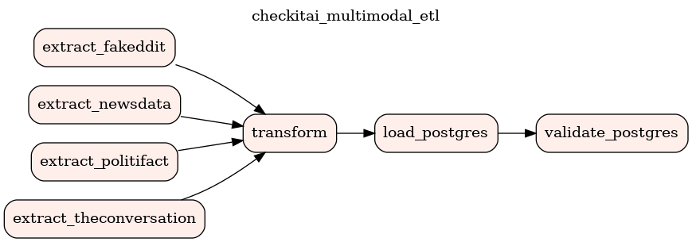
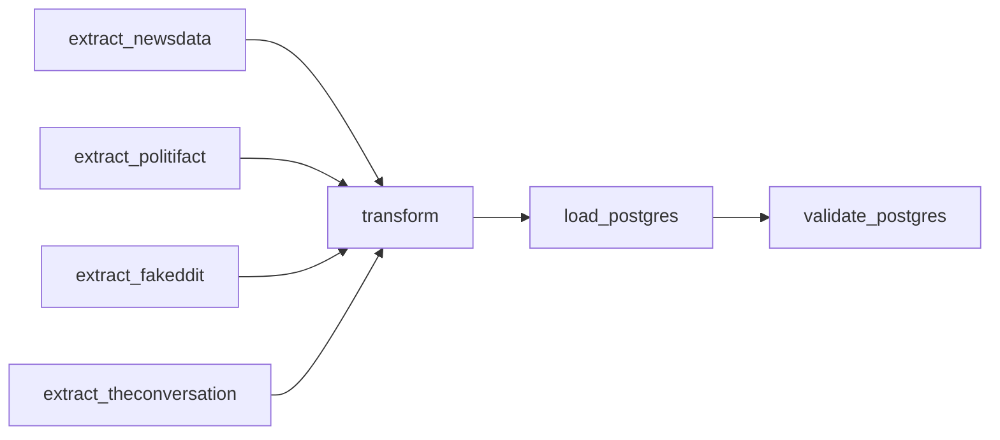

# Étape 04 — Orchestration du pipeline avec Airflow

## Objectif

Le DAG `checkitai_multimodal_etl` automatise l'acquisition, la transformation et
le chargement des publications multimodales. Il s'exécute localement avec Docker
Compose et sépare chaque responsabilité dans une tâche Airflow.





Les quatre extractions s'exécutent en parallèle. La transformation ne démarre
que lorsqu'elles ont toutes réussi. Le chargement et le contrôle PostgreSQL sont
ensuite exécutés dans cet ordre.

## Fichiers livrés

| Fichier | Rôle |
|---|---|
| `airflow/dags/checkitai_multimodal_etl.py` | DAG et sept tâches `PythonOperator` |
| `scripts/load_postgres.py` | création, upsert et validation de la table métier |
| `scripts/init_airflow_env.py` | génération locale des mots de passe et clés |
| `airflow/postgres-init/10-create-loader.sh` | création du rôle PostgreSQL restreint |
| `airflow/Dockerfile` | image Airflow et dépendances du projet |
| `docker-compose.airflow.yml` | services Airflow, base de métadonnées et entrepôt |
| `.env.airflow.example` | liste des paramètres disponibles, sans secret réel |

Les tâches appellent directement les fonctions Python des étapes 2 et 3. Il n'y
a donc pas de seconde implémentation de l'extraction ou de la transformation.

## Choix du stockage

PostgreSQL est adapté au contrat final : les 18 colonnes sont structurées et
typées, `publication_id` est une clé primaire, et les contraintes SQL protègent
les URLs, les dates, le hash d'image et l'association texte-image. L'upsert
`ON CONFLICT (publication_id)` rend le chargement rejouable sans dupliquer les
publications.

Les fichiers image ne sont pas placés dans PostgreSQL. Ils restent dans
`data/images/` ; la table conserve `image_path`, `image_url`, `image_sha256` et
`image_size_bytes`. Une ligne relie ainsi une publication à une image vérifiée,
sans alourdir la base avec des fichiers binaires.

Deux bases distinctes sont utilisées :

- `airflow-db` stocke uniquement les métadonnées techniques d'Airflow ;
- `warehouse` stocke la table métier `publication_multimodale`.

## Tâches du DAG

| Tâche | Entrée | Traitement | Sortie |
|---|---|---|---|
| `extract_newsdata` | API REST NewsData.io | requête JSON et images | lot JSON brut |
| `extract_politifact` | flux RSS | parsing Feedparser et images | lot JSON brut |
| `extract_fakeddit` | TSV local | lecture progressive et images | lot JSON brut |
| `extract_theconversation` | Atom et pages HTML | Requests + Beautiful Soup | lot JSON brut |
| `transform` | tous les lots JSON | nettoyage, mapping, validation, dédoublonnage | Parquet et JSONL |
| `load_postgres` | Parquet final | création de table et upsert par lots | lignes PostgreSQL |
| `validate_postgres` | table métier | contrôle volume, PK et texte-image | métriques dans XCom |

Chaque tâche possède deux tentatives supplémentaires sur échec, espacées de deux
minutes. `max_active_runs=1` empêche deux exécutions du pipeline de modifier les
mêmes sorties simultanément.

## Installation et exécution locale

Prérequis : Docker avec le plugin Compose, le fichier Fakeddit attendu par
l'étape 2 et une clé NewsData dans `.env`.

```bash
# 1. Générer .env.airflow avec des secrets aléatoires
uv run python scripts/init_airflow_env.py

# 2. Construire l'image reproductible
docker compose --env-file .env.airflow -f docker-compose.airflow.yml build

# 3. Initialiser Airflow et les comptes
docker compose --env-file .env.airflow -f docker-compose.airflow.yml up airflow-init

# 4. Démarrer l'interface, le scheduler et les deux bases
docker compose --env-file .env.airflow -f docker-compose.airflow.yml up -d
```

L'interface est disponible sur <http://localhost:8080>. Le nom utilisateur et
le mot de passe se trouvent dans `.env.airflow`. Ce fichier est privé et ignoré
par Git.

Le DAG peut être déclenché depuis l'interface ou sans intervention manuelle :

```bash
docker compose --env-file .env.airflow -f docker-compose.airflow.yml \
  exec airflow-scheduler airflow dags trigger checkitai_multimodal_etl
```

Contrôle de l'état des services et des erreurs d'import :

```bash
docker compose --env-file .env.airflow -f docker-compose.airflow.yml ps
docker compose --env-file .env.airflow -f docker-compose.airflow.yml \
  exec airflow-scheduler airflow dags list-import-errors
```

Arrêt sans supprimer les bases :

```bash
docker compose --env-file .env.airflow -f docker-compose.airflow.yml down
```

## Paramètres configurables

Les valeurs suivantes sont centralisées dans `.env.airflow` : limites par
source, nombre de pages NewsData, délai entre requêtes, mode de lecture des lots,
politique de dédoublonnage, taille des lots SQL, nom de table et planification.
`CHECKITAI_SCHEDULE` reste vide pour une démonstration déclenchée à la demande ;
la valeur `@daily` active par exemple une exécution quotidienne. Le DAG ne
contient aucun mot de passe ni clé API en dur.

## Sécurité appliquée

- secrets aléatoires générés dans `.env.airflow`, permissions locales `0600` ;
- `.env.airflow` exclu du dépôt Git ;
- clé Fernet et secret JWT propres à l'instance Airflow ;
- authentification obligatoire sur l'interface Airflow ;
- interface liée à `127.0.0.1` et ports PostgreSQL non publiés ;
- compte `checkitai_loader` dédié, sans droits superutilisateur, création de base
  ou création de rôle ;
- scripts montés en lecture seule dans les conteneurs Airflow ;
- transaction PostgreSQL avec rollback complet si un lot échoue.

Le pipeline ne collecte pas de mot de passe ni de donnée sensible métier. Pour
un déploiement distant, il faudrait en plus activer TLS entre Airflow et
PostgreSQL et utiliser un gestionnaire de secrets externe.

## Preuve d'exécution

Une exécution complète a été réalisée le 2 septembre 2026 avec le run Airflow
`manual__2026-09-02T12:28:34.482208+00:00` :

- état du DAG : `success` ;
- sept tâches sur sept : `success` dès la première tentative ;
- durée : de `12:28:34` à `12:28:56` UTC ;
- 1 077 publications chargées et 1 077 clés primaires distinctes ;
- 0 association multimodale invalide ;
- 0 doublon de `publication_id`.

Le détail vérifiable est conservé dans
[`evidence/E04_PREUVE_EXECUTION.md`](evidence/E04_PREUVE_EXECUTION.md). Les logs
complets d'une nouvelle exécution sont produits dans `airflow/logs/` et sont
consultables tâche par tâche dans l'interface.

Pour une capture d'écran de soutenance : ouvrir le DAG dans Airflow, sélectionner
le run, afficher la vue **Graph** avec les sept tâches vertes, puis enregistrer
l'image dans `docs/evidence/`.

## Validation du livrable

- [x] DAG importé et exécuté sans erreur en local.
- [x] Extraction, transformation, chargement et validation séparés.
- [x] Données structurées chargées dans PostgreSQL.
- [x] Authentification, secrets hors Git, réseau local et rôle restreint.
- [x] PostgreSQL justifié par le contrat tabulaire, les contraintes et l'upsert.
- [x] Logs et preuve d'exécution conservés.
